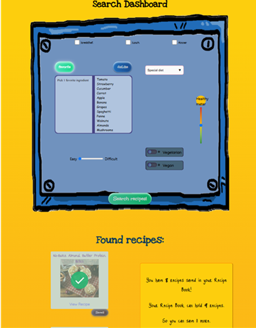

<h1>Recipe Buddy</h1>
<h2>Installatiehandleiding</h2>

<h3>Inleiding</h3>

RecipeBuddy is een React-applicatie waarmee gebruikers recepten kunnen zoeken, opslaan, bewerken en beheren via een externe API en backend. De App is speciaal bedoeld voor kinderen.

Deze app is gebouwd met Vite; een snelle bundler voor moderne front-end projecten.
 Git Repository:
 
https://github.com/IreneFelice/frontend-eindopdracht-app-recipe-buddy

Functionaliteiten
- Registreren & inloggen
- Recepten zoeken (via Edamam API)
- Recepten opslaan, bewerken en verwijderen
- Persoonlijk receptenboek

<h4>Benodigdheden</h4>
Systeemvereisten:
-	Node.js (versie 18 of hoger aanbevolen). Download via https://nodejs.org/
-	NPM (package manager, komt standaard mee met Node.js)
-	IDE zoals WebStorm of Visual Studio Code
-	Een moderne browser zoals Google Chrome of Firefox

<h4>Keys voor API en backend:</h4>
Deze applicatie communiceert met een externe backend. De URL hiervan staat ingesteld in de code. Je hoeft deze niet aan te passen. Voor het zoeken van recepten wordt gebruik gemaakt van de Edamam Recipe Search API. Maak daar een eigen account en Key aan, of vraag deze, net als de Key voor de backend, op bij de developer.

<h4>Installatie-instructie
Stappen voor het installeren van RecipeBuddy:</h4>
1.	Download of clone de repository.
2.	Geef in de Terminal het commando ‘npm.install’, om alle nodige dependencies te installeren. De juiste versies van alle dependencies, worden automatisch geïnstalleerd via het package.json en package-lock.json bestand.
3.	Maak in de root van de React projectmap een ‘.env’ bestand.
4.	Vul in dat bestand de verkregen Application ID en Key in, evenals de Key voor de backend; kopieer het benodigde format uit het bestand ‘.env.dist’ (ook in de root).
5.	Geef het commando ‘npm run dev’ om de applicatie te runnen.
6.	De app is toegankelijk via http://localhost:5173.

